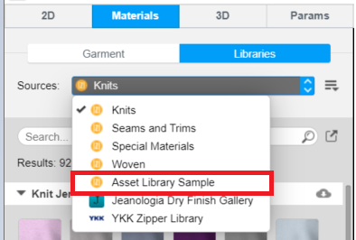

Asset Library is how you access materials for use in your garments. Use the Asset Library API to create a library, add a collection to a library, add an asset to a collection, and so on.

For more information about the feature, please visit <a href="https://support.browzwear.com/VStitcher/Materials/asset-lib.htm" target="_blank">here</a>.

To learn more about the rest of the Asset Library API, please refer to <a href="https://gitlab.com/browzwear/share/open-platform/client-api/-/blob/master/BWPlugin/include/AssetManagement/BWPluginAPI_AssetLibrary.h" target="_blank"> Asset Library</a> in the repository. 

## Sample plugin
Sample plugin for the asset library is available <a href="https://gitlab.com/browzwear/share/open-platform/client-api/-/tree/master/sample-plugins/python/Asset%20Library" target="_blank">here</a>

## Adding an asset library

### Code snippet
The library add function receives a JSON file (as a string) that contains all the library information. 

<!--DOCUSAURUS_CODE_TABS-->


<!--Python-->
```python
# assuming library_info is valid library info object
asset_library_id = BwApi.AssetLibAdd(library_info)
```
<!--C++-->
```cpp
// assuming libraryInfo is valid library info object
BwApiString* assetLibraryId = BwApiStringCreate();
BwApiAssetLibAdd(libraryInfo, assetLibraryId);
```
<!--C#-->
```csharp
// assuming libraryInfo is valid library info object
string assetLibraryId;
BwApi.AssetLibAdd(libraryInfo, out assetLibraryId);
```
<!--END_DOCUSAURUS_CODE_TABS-->

<br/>

### Result


## Updating an asset library
The code snippet below shows how to update an asset library in VStitcher/Lotta. The library add function receives a JSON file (as a string) that contains all the library information.
<!--DOCUSAURUS_CODE_TABS-->

<!--Python-->
```python
# assuming library_info is valid library info object
BwApi.AssetLibUpdate(asset_library_id, library_info)
```
<!--C++-->
```cpp
// assuming libraryInfo is valid library info object
BwApiAssetLibUpdate(BwApiStringGet(assetLibraryId), libraryInfo)
```
<!--C#-->
```csharp
// assuming libraryInfo is valid library info object
BwApi.AssetLibUpdate(assetLibraryId, libraryInfo);
```
<!--END_DOCUSAURUS_CODE_TABS-->
<br/>

## Getting asset library information

The code snippet below shows how to get the asset library information from VStitcher/Lotta. The asset library get function returns a JSON  file (as a string) that contains all the asset library information.
<!--DOCUSAURUS_CODE_TABS-->

<!--Python-->
```python
library_info = BwApi.AssetLibGet(asset_library_id)
```
<!--C++-->
```cpp
BwApiString* libraryInfoJson = BwApiStringCreate();
BwApiAssetLibGet(BwApiStringGet(assetLibraryId), libraryInfoJson);
```
<!--C#-->
```csharp
BwApi.AssetLibGet(assetLibraryId, out libraryInfoJson);
```
<!--END_DOCUSAURUS_CODE_TABS-->
<br/>

## Removing an asset library

The code snippet below shows how to remove an asset library from VStitcher/Lotta.
<br/>
<!--DOCUSAURUS_CODE_TABS-->

<!--Python-->
```python
BwApi.AssetLibRemove(asset_library_id)
```
<!--C++-->
```cpp
BwApiAssetLibRemove(BwApiStringGet(assetLibraryId));
```
<!--C#-->
```csharp
BwApi.AssetLibRemove(assetLibraryId);
```
<!--END_DOCUSAURUS_CODE_TABS-->
<br/>

## Registering an asset library event

You can register your plugin to be notified when certain asset library  events happen. 
 
The supported events are: 
 - BW_API_EVENT_ASSET_LIB_INITIALIZE
 - BW_API_EVENT_ASSET_LIB_DOWNLOAD_ASSET
 - BW_API_EVENT_ASSET_LIB_OPEN_EXTERNAL_LINK - if registered, the external link is enabled
 - BW_API_EVENT_ASSET_LIB_REFRESH
<br/>

<!--DOCUSAURUS_CODE_TABS-->


<!--Python-->
```python
class EventCallback(BwApi.CallbackBase):
  def Run(self, garment_id, callback_id, data_string):
    # callback for asset library initialazation
    if (callbackId == 1){
    # do some stuff here
    }
    return 1

callback = EventCallback()

def BwApiPluginInit():
  funcId = BwApi.AssetLibEventRegister(callback, 1, BwApi.BW_API_EVENT_ASSET_LIB_INITIALIZE)
  return 1
```

<!--C++-->
```cpp
class CEventCallback : public BwApiCallbackBase
{
public:
  virtual int Run(const char* garmentId, long callbackId,  const char* dataString);
  {
    // callback for asset library initialazation
    if (callbackId == 1){
      // do some stuff here
    }
    return 1;
  }
};

CEventCallback callback;

BW_PLUGIN_EXPORT int WINAPI BwApiPluginInit()
{
  int funcId = 0;
  BwApiEventRegister(&callback, 1, BW_API_EVENT_ASSET_LIB_INITIALIZE, &funcId);
  return 1;
}
```

<!--C#-->
```csharp
using BwPluginApi;
class EventCallback : CallbackBase
{
    public override int Run(string garmentId, int callbackId, string dataString)
    {
      // callback for asset library initialazation
      if (callbackId == 1){
        // do some stuff here
      }
    }
}

public static EventCallback callback = new EventCallback();

class BwApiPlugin
{
  public static int Init(string args)
  {
    int funcId = 0;
    BwApi.EventRegister(callback, 1, EventType.BW_API_EVENT_ASSET_LIB_INITIALIZE, out funcId);
    return 1;
  }
}
```
<!--END_DOCUSAURUS_CODE_TABS-->
<br/>

## Adding a collection to an asset library

The code snippet below shows how to add a collection to the asset library. The asset library collection add function receives a JSON file (as a string) that contains all the collection's information. For more information, refer to: app installation folder\Resources\schema\v2\asset-management\asset-library\collection.json.
<br/>
<!--DOCUSAURUS_CODE_TABS-->


<!--Python-->
```python
BwApi.AssetLibCollectionAdd(asset_library_id, collection_json)
```
<!--C++-->
```cpp
BwApiAssetLibCollectionAdd(BwApiStringGet(assetLibraryId), collectionJson, &collectionId);
```
<!--C#-->
```csharp
BwApi.AssetLibCollectionAdd(assetLibraryId, collectionJson, out collectionId);
```
<!--END_DOCUSAURUS_CODE_TABS-->
<br/>

## Removing a collection from an asset library
The code snippet below shows how to remove a collection from an asset library. 
<!--DOCUSAURUS_CODE_TABS-->


<!--Python-->
```python
BwApi.AssetLibCollectionRemove(asset_library_id, collection_id)
```
<!--C++-->
```cpp
const char* collectionJson;
BwApiAssetLibCollectionRemove(BwApiStringGet(assetLibraryId), collectionId);
```
<!--C#-->
```csharp
BwApi.AssetLibCollectionRemove(assetLibraryId, collectionId);
```
<!--END_DOCUSAURUS_CODE_TABS-->
<br/>


<a name="asset-library-collection-asset-ids"></a>
## Getting asset ids from a collection
The code snippet below shows how to get the asset ids from a collection.
<br/>
<!--DOCUSAURUS_CODE_TABS-->

<!--Python-->
```python
asset_ids = BwApi.AssetLibCollectionAssetIds(asset_library_id, collection_id)
```
<!--C++-->
```cpp
BwApiVectorInt* assetIds = BwApiVectorIntCreate();
BwApiAssetLibCollectionAssetIds(BwApiStringGet(assetLibraryId), assetIds);
```
<!--C#-->
```csharp
BwApiVectorInt assetIds = new BwApiVectorInt();
BwApi.AssetLibCollectionAssetIds(assetLibraryId, assetIds);
```
<!--END_DOCUSAURUS_CODE_TABS-->
<br/>

## Adding an asset to a collection
The code snippet below shows how to add an asset to a collection. 
<br/>
<!--DOCUSAURUS_CODE_TABS-->

<!--Python-->
```python
BwApi.AssetLibCollectionAssetAdd(asset_library_id, collection_id, asset_id)
```
<!--C++-->
```cpp
const char* collectionJson;
BwApiAssetLibCollectionAssetAdd(BwApiStringGet(assetLibraryId), collectionId, assetId);
```
<!--C#-->
```csharp
BwApi.AssetLibCollectionAssetAdd(assetLibraryId, collectionId, assetId);
```
<!--END_DOCUSAURUS_CODE_TABS-->
<br/>

## Removing an asset from a collection
The code snippet below shows how to remove an asset from a collection. 
<!--DOCUSAURUS_CODE_TABS-->

<!--Python-->

```python
BwApi.AssetLibCollectionAssetRemove(asset_library_id, collection_id, asset_id)
```
<!--C++-->
```cpp
const char* collectionJson;
BwApiAssetLibCollectionAssetRemove(BwApiStringGet(assetLibraryId), collectionId, assetId);
```
<!--C#-->
```csharp
BwApi.AssetLibCollectionAssetRemove(assetLibraryId, collectionId, assetId);
```
<!--END_DOCUSAURUS_CODE_TABS-->

<br/>

## Getting asset ids from an asset library
The code snippet below shows how to get the asset ids from a asset library.
<br/>
<!--DOCUSAURUS_CODE_TABS-->

<!--Python-->

```python
asset_ids = BwApi.AssetLibAssetIds(asset_library_id)
```
<!--C++-->

```cpp
BwApiVectorInt* assetIds = BwApiVectorIntCreate();
BwApiAssetLibAssetIds(BwApiStringGet(assetLibraryId), assetIds);
```
<!--C#-->

```csharp
BwApiVectorInt assetIds = new BwApiVectorInt();
BwApi.AssetLibAssetIds(assetLibraryId, assetIds);
```
<!--END_DOCUSAURUS_CODE_TABS-->

<br/>
## Adding an asset to an asset library
The code snippet below shows how to add an asset to an asset library. The asset library asset add function receives a JSON file (as a string) that contains all the asset's information. For more information, refer to: app installation folder\Resources\schema\v2\asset-management\asset-library\asset.json.
<br/>
<!--DOCUSAURUS_CODE_TABS-->

<!--Python-->

```python
# assuming asset_json contains the above asset object settings
asset_id = BwApi.AssetLibAssetAdd(asset_library_id, asset_json)
```
<!--C++-->

```cpp
// assuming assetJson contains the above asset object 
BwApiAssetLibAssetAdd(BwApiStringGet(assetLibraryId), assetJson, &assetId);
```
<!--C#-->

```csharp
// assuming assetJson contains the above asset object 
BwApi.AssetLibAssetAdd(assetLibraryId, assetJson, out assetId);
```
<!--END_DOCUSAURUS_CODE_TABS-->

<br/>

## Removing an asset from an asset library
The code snippet below shows how to remove an asset from an asset library. 
<!--DOCUSAURUS_CODE_TABS-->

<!--Python-->

```python
BwApi.AssetLibAssetRemove(asset_library_id, asset_id)
```
<!--C++-->

```cpp
const char* collectionJson;
BwApiAssetLibAssetRemove(BwApiStringGet(assetLibraryId), assetId);
```
<!--C#-->

```csharp
BwApi.AssetLibAssetRemove(assetLibraryId, assetId);
```
<!--END_DOCUSAURUS_CODE_TABS-->

<br/>


## Configuring library information
Configure library.json file with your library information.
For more information, refer to: app installation folder\Resources\schema\\{version}\asset-management\asset-library\library.json.
<br/>


