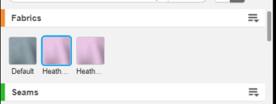

Materials are fabrics, seams, artworks or trims on a garment. Use the Material API to add new material, set material physics, remove materials, and so on. <br/>

For more information about the feature, please visit <a href="https://support.browzwear.com/VStitcher/Materials/materials.htm" target="_blank">here</a>.

To learn more about the rest of the API, please refer to <a href="https://gitlab.com/browzwear/share/open-platform/client-api/-/blob/master/BWPlugin/include/AssetManagement/BWPluginAPI_Material.h" target="_blank">Material</a> in the repository.

## Sample Plugin
Sample plugin for Materials is available <a href="https://gitlab.com/browzwear/share/open-platform/client-api/-/tree/master/sample-plugins/python" target="_blank">here</a>

## Importing U3M

### Code Snippet

<!--DOCUSAURUS_CODE_TABS-->

<!--Python-->

```python
garment_id = BwApi.GarmentId()
colorwayId = BwApi.ColorwayCurrentGet(garment_id )
full_path = '<path to the u3m>'
material_ids = MaterialImport(garmentId, colorwayId, fullPath)
```
<!--C++-->

```cpp
BwString garmentId;
BwApiGarmentId(garmentId);
int colorwayId;
BwApiColorwayCurrentGet(BwApiStringGet(garmentId), &colorwayId);
BwApiVectorInt* materialIds = BwApiVectorIntCreate();
BwApiMaterialImport(BwApiStringGet(garmentId), colorwayId, "<path to the u3m>", materialIds);
```
<!--C#-->

```csharp
string garmentId;
BwApi.GarmentId(out garmentId);
int colorwayId;
BwApi.ColorwayCurrentGet(garmentId, out colorwayId);
BwApiVectorInt materialIds = new BwApiVectorInt();
BwApi.MaterialImport(garmentId, colorwayId, "path to the u3m", materialIds);
```
<!--END_DOCUSAURUS_CODE_TABS-->
<br/>

### Result


## Exporting U3M

### Code Snippet

<!--DOCUSAURUS_CODE_TABS-->

<!--Python-->

```python
garment_id = BwApi.GarmentId()
colorwayId = BwApi.ColorwayCurrentGet(garment_id )
full_path = '<path to export the u3m>'
MaterialExport(garmentId, colorwayId, 1, fullPath)
```
<!--C++-->

```cpp
BwString garmentId;
BwApiGarmentId(garmentId);
int colorwayId;
BwApiColorwayCurrentGet(BwApiStringGet(garmentId), &colorwayId);
BwApiVectorInt* materialIds = BwApiVectorIntCreate();
BwApiMaterialExport(BwApiStringGet(garmentId), colorwayId, 1, "<path to export the u3m>")
```
<!--C#-->

```csharp
string garmentId;
BwApi.GarmentId(out garmentId);
int colorwayId;
BwApi.ColorwayCurrentGet(garmentId, out colorwayId);
BwApiVectorInt materialIds = new BwApiVectorInt();
BwApi.MaterialExport(garmentId, colorwayId, 1, "path to export the u3m")
```
<!--END_DOCUSAURUS_CODE_TABS-->
<br/>


## Getting Material by id

### Code Snippet

<!--DOCUSAURUS_CODE_TABS-->

<!--Python-->

```python
# get existing material as json string object
materialJson = BwApi.MaterialGet(garmentId, colorwayId, materialId)
```
<!--C++-->

```cpp
// get existing material as json string object
BwString materialJson;
BwApiMaterialGet(garmentId, colorwayId, materialId, materialJson);
```
<!--C#-->

```csharp
// get existing material as json string object
BwApiString materialJson = new BwApiString();
BwApi.MaterialGet(garmentId, colorwayId, materialId, out materialJson);
```
<!--END_DOCUSAURUS_CODE_TABS-->

<br/>

### Result

material json object as string containing all the material's information. see <a href="https://gitlab.com/browzwear/share/open-platform/client-api/-/blob/master/BWPlugin/schema/api/v2.0/material/material.json" target="_blank">schema</a>

## Deleting a Material

### Code Snippet
The code snippet below shows how to delete an existing material. <br/>
<!--DOCUSAURUS_CODE_TABS-->

<!--Python-->

```python
# delete an existing material
BwApi.MaterialDelete(garmentId, colorwayId, materialId)
```
<!--C++-->

```cpp
// delete an existing material
BwApiMaterialDelete(garmentId, colorwayId, materialId);
```
<!--C#-->

```csharp
// delete an existing material
BwApi.MaterialDelete(garmentId, colorwayId, materialId);
```
<!--END_DOCUSAURUS_CODE_TABS-->

<br/>

### Result


## Cloning a Material

### Code Snippet
The code snippet below shows how to clone an existing material to any colorway. <br/>
<!--DOCUSAURUS_CODE_TABS-->

<!--Python-->

```python
# clone an existing material
newMaterialId = BwApi.MaterialClone(garmentId, colorwayId, materialId, destColorwayId)
```
<!--C++-->

```cpp
// clone an existing material
int newMaterialId;
BwApiMaterialClone(garmentId, colorwayId, materialId, destColorwayId, &newMaterialId);
```
<!--C#-->

```csharp
// clone an existing material
int newMaterialId;
BwApi.MaterialClone(garmentId, colorwayId, materialId, destColorwayId, out newMaterialId);
```
<!--END_DOCUSAURUS_CODE_TABS-->
<br/>

### Result


## Updating a Material

### Code Snippet
<!--DOCUSAURUS_CODE_TABS-->

<!--Python-->


```python
# update an existing material
# assuming materialJson contains the above material
BwApi.MaterialUpdate(garmentId, colorwayId, materialId, materialJson)
```
<!--C++-->

```cpp
// update an existing material
// assuming materialJson contains the above material
BwApiMaterialUpdate(garmentId, colorwayId, materialId, materialJson);
```
<!--C#-->

```csharp
// update an existing material
// assuming materialJson contains the above material
BwApi.MaterialUpdate(garmentId, colorwayId, materialId, materialJson);
```
<!--END_DOCUSAURUS_CODE_TABS-->

<br/>
