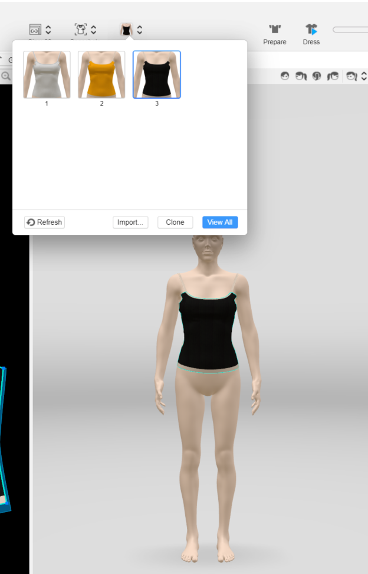
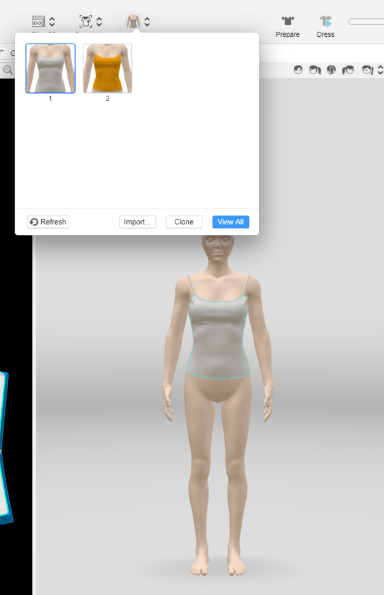
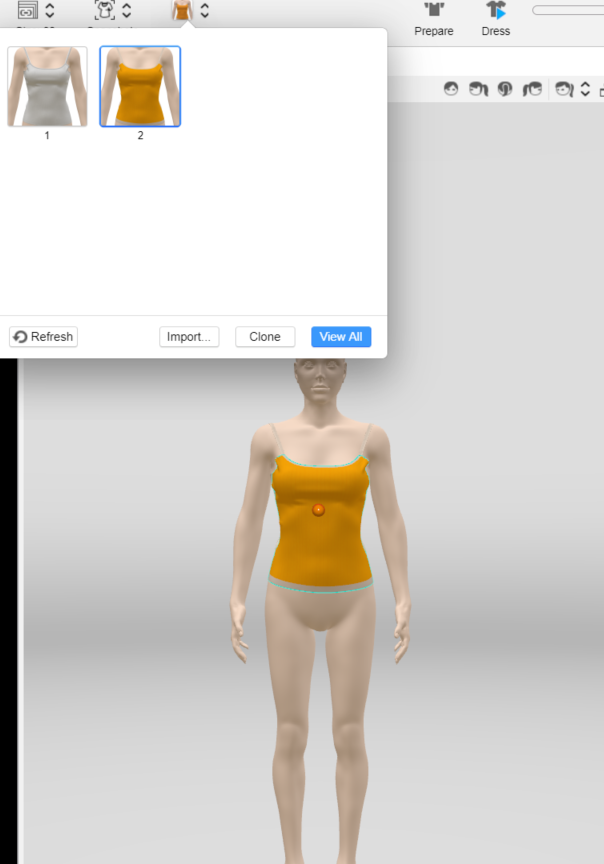
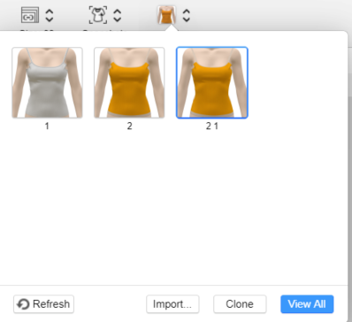
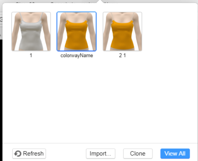

Colorway is a combination of color, seams, trims, fabrics, and artwork of a garment. Use the Colorway API to create multiple colorways for a garment, update colorway and so on. 

For more information about the feature, please visit <a href="https://support.browzwear.com/VStitcher/Colorways/colorways-vs.htm" target="_blank">here</a>.

To learn more about the rest of the API, please refer to <a href="https://gitlab.com/browzwear/share/open-platform/client-api/-/blob/master/BWPlugin/include/CAD/BWPluginAPI_Colorway.h" target="_blank">Colorway</a> in the repository.


## Getting Colorways ids 

### Code Snippet

<!--DOCUSAURUS_CODE_TABS-->

<!--Python-->

```python
BwApi.GarmentColorwayIds(garment_id)
```
<!--C++-->

```cpp
BwApiGarmentColorwayIds(garmentId);
```
<!--C#-->

```csharp
BwApi.GarmentColorwayIds(garmentId);
```
<!--END_DOCUSAURUS_CODE_TABS-->
<br/>

### Result
Ids of the following colorways:


## Deleting a Colorway

### Code Snippet

<!--DOCUSAURUS_CODE_TABS-->

<!--Python-->

```python
# assuming colorway_id is a valid colorway id
BwApi.ColorwayDelete(garment_id, colorway_id)
```
<!--C++-->

```cpp
// assuming colorwayId is a valid colorway id
BwApiColorwayDelete(garmentId, colorwayId);
```
<!--C#-->

```csharp
// assuming colorwayId is a valid colorway id
BwApi.ColorwayDelete(garmentId, colorwayId);
```
<!--END_DOCUSAURUS_CODE_TABS-->
<br/>

### Result


## Getting the Current Colorway

### Code Snippet
<!--DOCUSAURUS_CODE_TABS-->

<!--Python-->

```python
current_colorway = BwApi.ColorwayCurrentGet(garment_id)
```
<!--C++-->

```cpp
int currentColorway;
BwApiColorwayCurrentGet(garmentId, &currentColorway);
```
<!--C#-->

```csharp
BwApi.ColorwayCurrentGet(garmentId, out currentColorway);
```
<!--END_DOCUSAURUS_CODE_TABS-->
<br/>

### Result
The id of the curent colorway.

## Setting the Current Colorway

### Code Snippet
<!--DOCUSAURUS_CODE_TABS-->

<!--Python-->

```python
# assuming the colorway_id is a valid colorway id
BwApi.ColorwayCurrentSet(garment_id, colorway_id)
```
<!--C++-->

```cpp
// assuming the colorwayId is a valid colorway id
BwApiColorwayCurrentSet(garmentId, colorwayId);
```
<!--C#-->

```csharp
// assuming the colorwayId is a valid colorway id
BwApi.ColorwayCurrentSet(garmentId, colorwayId);
```
<!--END_DOCUSAURUS_CODE_TABS-->

<br/>

### Result


## Cloning a Colorway

### Code Snippet
<br/>
<!--DOCUSAURUS_CODE_TABS-->

<!--Python-->

```python
# assuming the colorway_id is a valid colorway id
new_colorway_id = BwApi.ColorwayClone(garment_id, colorway_id)
```
<!--C++-->

```cpp
int newColorwayId;
// assuming the colorwayId is a valid colorway id
BwApiColorwayClone(garmentId, colorwayId, &newColorwayId);
```
<!--C#-->

```csharp
int newColorwayId;
// assuming the colorwayId is a valid colorway id
BwApi.ColorwayClone(garmentId, colorwayId, out newColorwayId);
```
<!--END_DOCUSAURUS_CODE_TABS-->
<br/>

### Result


## Getting the Material ids of a Colorway

### Code Snippet
<!--DOCUSAURUS_CODE_TABS-->

<!--Python-->

```python
# assuming the colorway_id is a valid colorway id
BwApi.ColorwayMaterialIds(garment_id, colorway_id)
```
<!--C++-->

```cpp
  BwApiVectorInt* materialIds = BwApiVectorIntCreate();
  // assuming the colorwayId is a valid colorway id
BwApiColorwayMaterialIds(garmentId, colorwayId, materialIds);
```
<!--C#-->

```csharp
BwApiVectorInt materialIds = new BwApiVectorInt();
// assuming the colorwayId is a valid colorway id
BwApi.ColorwayMaterialIds(garmentId, colorwayId, materialIds);
```
<!--END_DOCUSAURUS_CODE_TABS-->
<br/>

### Result
A list of material ids from given colorway id

## Getting the Colorway Name

### Code Snippet
<br/>
<!--DOCUSAURUS_CODE_TABS-->

<!--Python-->

```python
# assuming the colorway_id is a valid colorway id
BwApi.ColorwayNameGet(garment_id, colorway_id)
```
<!--C++-->

```cpp
BwApiString* colorwayName = BwApiStringCreate();
// assuming the colorway_id is a valid colorway id
BwApiColorwayNameGet(garmentId, colorwayId, colorwayName);
```
<!--C#-->

```csharp
string colorwayName;
// assuming the colorway_id is a valid colorway id
BwApi.ColorwayNameGet(garmentId, colorwayId, out colorwayName);
```
<!--END_DOCUSAURUS_CODE_TABS-->

<br/>

### Result
The name of the colorway

## Setting the Colorway Name

### Code Snippet
<br/>
<!--DOCUSAURUS_CODE_TABS-->

<!--Python-->


```python
# assuming the colorway_id is a valid colorway id
BwApi.ColorwayNameSet(garment_id, colorway_id, 'colorway name')
```
<!--C++-->

```cpp
// assuming the colorway_id is a valid colorway id
BwApiColorwayNameSet(garmentId, colorwayId, "colorway name");
```
<!--C#-->

```csharp
string colorwayName;
// assuming the colorway_id is a valid colorway id
BwApi.ColorwayNameSet(garmentId, colorwayId, "colorway name");
```
<!--END_DOCUSAURUS_CODE_TABS-->
<br/>

### Result


## Getting Colors in Use

### Code Snippet
<br/>
<!--DOCUSAURUS_CODE_TABS-->

<!--Python-->

```python
# assuming the colorway_id is a valid colorway id
colors_in_use = BwApi.ColorwayColorsInUseGet(garment_id, colorway_id)
```
<!--C++-->

```cpp
BwApiVectorColor* colors = BwApiVectorColorCreate();
// assuming the colorwayId is a valid colorway id
BwApiColorwayColorsInUseGet(garmentId, colorwayId, colors);
```
<!--C#-->

```csharp
BwApiVectorColor colors = new BwApiVectorColor();
// assuming the colorwayId is a valid colorway id
BwApi.ColorwayColorsInUseGet(garmentId, colorwayId, colors);
```
<!--END_DOCUSAURUS_CODE_TABS-->

<br/>

### Result
The colors in use in a colorway.
The return value from this function is an array of color.
Note: color is represented by RGB data.

## Updating Colors in Use

### Code Snippet
<br/>
<!--DOCUSAURUS_CODE_TABS-->

<!--Python-->

```python
# assuming the colorway_id is a valid colorway id
BwApi.ColorwayColorsInUseUpdate(garment_id, colorway_id, src_color, dest_color)
```
<!--C++-->

```cpp
// assuming the colorwayId is a valid colorway id
BwApiColorwayColorsInUseUpdate(garmentId, colorwayId, srcColor, destColor);
```
<!--C#-->

```csharp
// assuming the colorwayId is a valid colorway id
BwApi.ColorwayColorsInUseUpdate(garmentId, colorwayId, srcColor, destColor);
```
<!--END_DOCUSAURUS_CODE_TABS-->

<br/>
