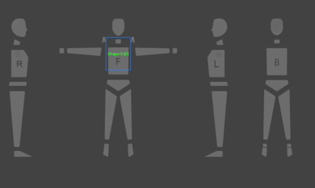
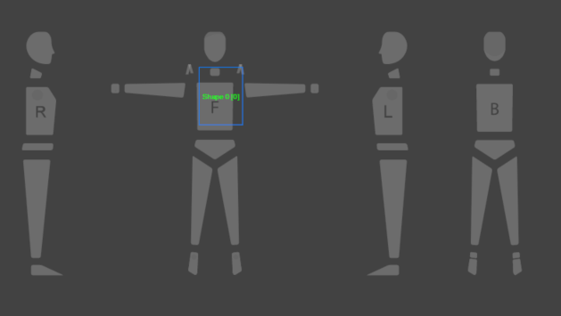
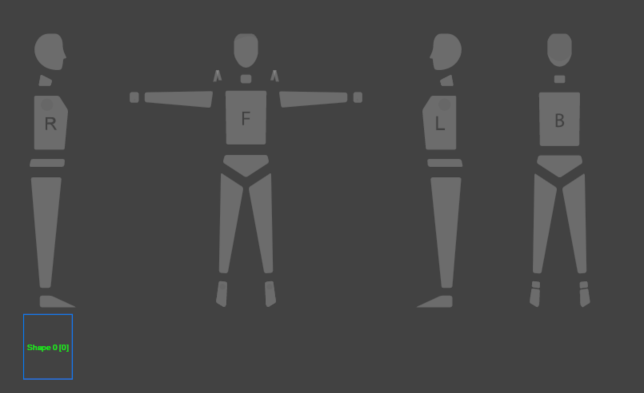

Clusters is how you arrange shapes on a avatar. Use the Cluster API to create a cluster, add shapes to a cluster, remove a cluster, and so on.

For more information about the feature, please visit <a href="https://support.browzwear.com/VStitcher/Basic/arranging-vs.htm" target="_blank">here</a>.

To learn more about the rest of the API, please refer to <a href="https://gitlab.com/browzwear/share/open-platform/client-api/-/blob/master/BWPlugin/include/CAD/BWPluginAPI_Cluster.h" target="_blank">Cluster</a> in the repository.

## Sample Plugin
Sample plugin for garment creation is available <a href="https://gitlab.com/browzwear/share/open-platform/client-api/-/tree/master/sample-plugins/python/GarmentCreation" target="_blank">here</a>

Sample plugin for cluster arragement is available <a href="https://gitlab.com/browzwear/share/open-platform/client-api/-/tree/master/sample-plugins/python/fix-cluster-position" target="_blank">here</a>

## Creating a Cluster
### Code Snippet
<!--DOCUSAURUS_CODE_TABS-->

<!--Python-->

```python
# Create new cluster (Front Torso)
clusterId = BwApi.ClusterCreate(garmentId,
                                BwApi.BW_API_CLUSTER_SILHOUETTE_VIEW_FRONT,
                                BwApi.BW_API_CLUSTER_SILHOUETTE_LOCATION_TORSO)
```
<!--C++-->

```cpp
// Create new cluster (Front Torso)
int clusterId = 0;
BwApiClusterCreate(garmentId,
                  BW_API_CLUSTER_SILHOUETTE_VIEW_FRONT,
                  BW_API_CLUSTER_SILHOUETTE_LOCATION_TORSO,
                  &clusterId);
```
<!--C#-->

```csharp
// Create new cluster (Front Torso)
int clusterId = 0;
BwApi.ClusterCreate(garmentId,
                  ClusterSilhouetteView.BW_API_CLUSTER_SILHOUETTE_VIEW_FRONT,
                  ClusterSilhouetteLocation.BW_API_CLUSTER_SILHOUETTE_LOCATION_TORSO,
                  &clusterId);
```
<!--END_DOCUSAURUS_CODE_TABS-->
<br/>

### Result
New cluster id.<br>
Note: Creating a cluster without any shape doesn't do anything. <br/>

## Adding Shape to a Cluster
A cluster may have more than one shape associated with it.

### Code Snippet

<!--DOCUSAURUS_CODE_TABS-->

<!--Python-->

```python
# Add existing shape to an existing cluster
BwApi.ClusterShapeAdd(garmentId, clusterId, shapeId)
```
<!--C++-->

```cpp
// Add existing shape to an existing cluster
result = BwApiClusterShapeAdd(garmentId,
                              clusterId,
                              shapeId);
```
<!--C#-->

```csharp
// Add existing shape to an existing cluster
BwApi.ClusterShapeAdd(garmentId,
                      clusterId,
                      shapeId);

```
<!--END_DOCUSAURUS_CODE_TABS-->
<br/>

### Result


## Setting Shape Offset on a Cluster

### Code Snippet
The code snippet below shows how to set the shape offset from the cluster hanging point.
<!--DOCUSAURUS_CODE_TABS-->

<!--Python-->

```python
# Get the current shape offset
offset = BwApi.ClusterShapeOffsetGet(garmentId, clusterId, shapeId)

# Move the shape a little bit
offset.x = offset.x + 5
offset.y = offset.y + 2

# Update the shape offset
BwApi.ClusterShapeOffsetSet(garmentId, clusterId, shapeId, offset)
```
<!--C++-->

```cpp
// Get the current shape offset
BwApiCoodinatesXY offset;
BwApiClusterShapeOffsetGet(garmentId, clusterId, shapeId, &offset);

// Move the shape a little bit
offset.x = offset.x + 5;
offset.y = offset.y + 2;

// Update the shape offset
BwApiClusterShapeOffsetSet(garmentId, clusterId, shapeId, offset);
```
<!--C#-->

```csharp
// Get the current shape offset
CoordinatesXY offset = new CoordinatesXY();
BwApi.ClusterShapeOffsetGet(garmentId, clusterId, shapeId, out offset);

// Move the shape a little bit
offset.x = offset.x + 5;
offset.y = offset.y + 2;

// Update the shape offset
BwApi.ClusterShapeOffsetSet(garmentId, clusterId, shapeId, offset);
```
<!--END_DOCUSAURUS_CODE_TABS-->

<br/>

### Result



## Removing a Shape from a Cluster

### Code Snippet
<!--DOCUSAURUS_CODE_TABS-->

<!--Python-->

```python
# remove the shape from the cluster
BwApi.ClusterShapeRemove(garmentId, clusterId, shapeId)
```
<!--C++-->

```cpp
// remove the shape from the cluster
BwApiClusterShapeRemove(garmentId, clusterId, shapeId);
```
<!--C#-->

```csharp
// remove the shape from the cluster
BwApi.ClusterShapeRemove(garmentId, clusterId, shapeId);
```
<!--END_DOCUSAURUS_CODE_TABS-->
<br/>

### Result


## Deleting a Cluster

### Code Snippet
<!--DOCUSAURUS_CODE_TABS-->

<!--Python-->

```python
# delete a cluster
BwApi.ClusterDelete(garmentId, clusterId)
```
<!--C++-->

```cpp
// delete a cluster
BwApiClusterDelete(garmentId, clusterId);
```
<!--C#-->

```csharp
// delete a cluster
BwApi.ClusterDelete(garmentId, clusterId);
```
<!--END_DOCUSAURUS_CODE_TABS-->
<br/>

### Result

Note: Shapes associated with the cluster have no cluster after this action completes.
