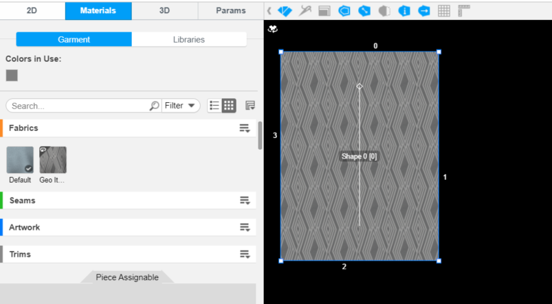
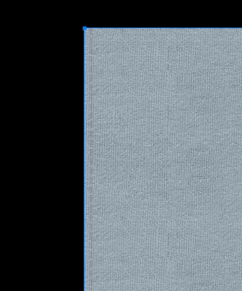

Assign Material is how you add a material to a shape or edge of a garment. Use the Shape or Edge API to assign, replace a fabric, seam, artwork, trim and so on.

For more information about the feature, please visit <a href="https://support.browzwear.com/VStitcher/Materials/materials.htm" target="_blank">here</a>.

## Sample Plugin
Sample plugin for garment creation is available <a href="https://gitlab.com/browzwear/share/open-platform/client-api/-/tree/master/sample-plugins/python/GarmentCreation" target="_blank">here</a>

## Assign Fabric

### Code Snippet
<!--DOCUSAURUS_CODE_TABS-->

<!--Python-->
```python
BwApi.ShapeMaterialIdSet(garmentId, shapeId, materialId)
```
<!--C++-->
```cpp
BwApiShapeMaterialIdSet(garmentId, shapeId, materialId);
```
<!--C#-->
```csharp
BwApiShapeMaterialIdSet(garmentId, shapeId, materialId);
```
<!--END_DOCUSAURUS_CODE_TABS-->

<br/>

### Result


## Assign Seam

### Code Snippet
<!--DOCUSAURUS_CODE_TABS-->

<!--Python-->
```python
BwApi.EdgeMaterialIdSet(garmentId, shapeId, edgeId, materialId)
```
<!--C++-->
```cpp
BwApiEdgeMaterialIdSet(garmentId, shapeId, edgeId, materialId);
```
<!--C#-->
```csharp
BwApiEdgeMaterialIdSet(garmentId, shapeId, edgeId, materialId);
```
<!--END_DOCUSAURUS_CODE_TABS-->

<br/>

### Result


## Assign Artwork

### Code Snippet

## Assign Trim

### Code Snippet
