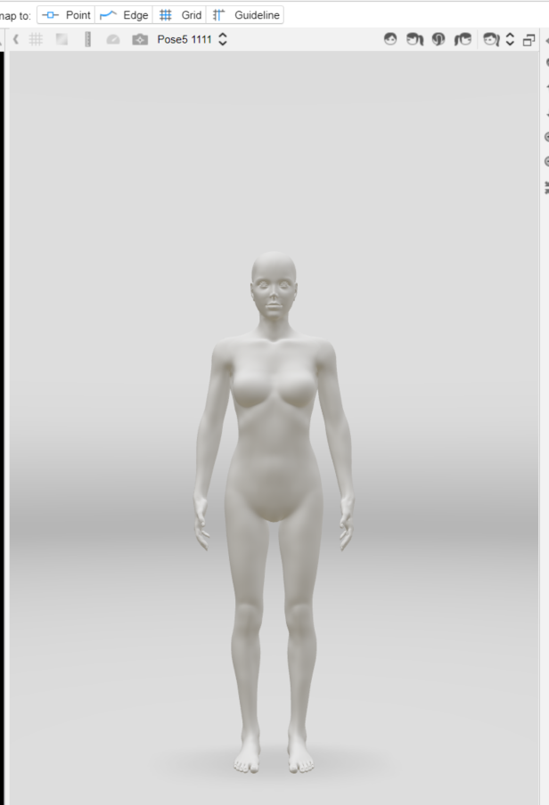

Create Avatar is how you modify the measurements of a template and create your own avatar. Use the Avatar api to create, select a avatar and so on. 

For more information about the feature, please visit <a href="https://support.browzwear.com/VStitcher/Avatars/avatars.htm" target="_blank">here</a>.

To learn more about the rest of the Avatar API, please refer to <a href="https://gitlab.com/browzwear/share/open-platform/client-api/-/blob/master/BWPlugin/include/General/BWPluginAPI_Avatar.h" target="_blank">Avatar</a> in the repository.

## Sample Plugin
Sample plugin for Avatars is available <a href="https://gitlab.com/browzwear/share/open-platform/client-api/-/tree/master/sample-plugins/python/Avatar" target="_blank">here</a>

## Create a Avatar using a Template

### Code Snippet

## Setting Current Avatar

### Code Snippet

<br/>
<!--DOCUSAURUS_CODE_TABS-->

<!--Python-->
```python
# assuming avatarId is a valid avatar id in the system
BwApi.AvatarCurrentSet(avatarId)
```
<!--C++-->
```cpp
// assuming avatarId is a valid avatar id in the system
BwApiAvatarCurrentSet(avatarId);
```
<!--C#-->
```csharp
// assuming avatarId is a valid avatar id in the system
BwApi.AvatarCurrentSet(avatarId);
```
<!--END_DOCUSAURUS_CODE_TABS-->

<br/>

### Result

