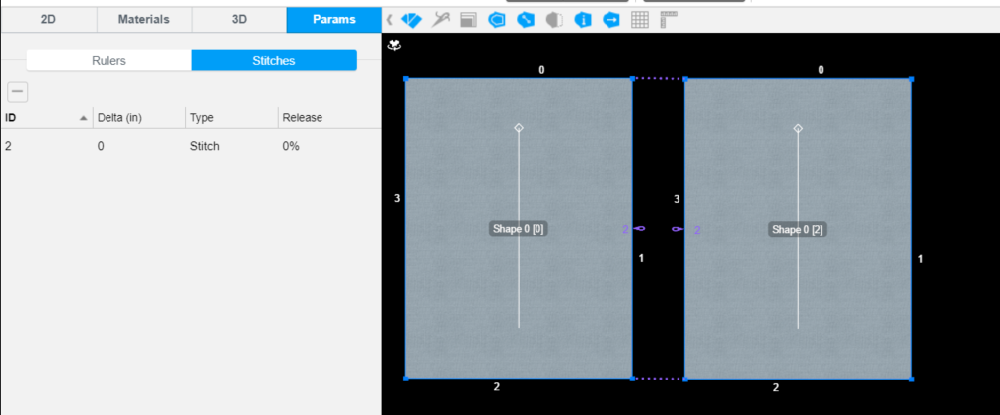

Stitch Shapes is how you combine 2 edges, internal edges, or points together and combine multiple shapes together to create a garment. Use the Stitch edge to create, delete a stitch and so on

For more information about the feature, please visit <a href="https://support.browzwear.com/VStitcher/Stitching/stitch-vs.htm" target="_blank">here</a>.

To learn more about the rest of the API, please refer to <a href="https://gitlab.com/browzwear/share/open-platform/client-api/-/blob/master/BWPlugin/include/CAD/BWPluginAPI_Stitch.h" target="_blank">Stitch</a> in the repository.

## Sample Plugin
Sample plugin for garment creation is available <a href="https://gitlab.com/browzwear/share/open-platform/client-api/-/tree/master/sample-plugins/python/GarmentCreation" target="_blank">here</a>

## Create a Stitch
### Code Snippet
<!--DOCUSAURUS_CODE_TABS-->

<!--Python-->

```python
stitch_side1 = BwApi.StitchSide(from_shape, from_edge, 0, 100) 
stitch_side2 = BwApi.StitchSide(to_shape, to_edge, 0, 100)  
# Create a new stitch
BwApi.StitchCreate(BwApi.GarmentID(), stitch_side1, stitch_side2)
```
<!--C++-->

```cpp
// Create a new stitch
BwApiStitchCreate(garmentId, side1, side2);
```
<!--C#-->

```csharp
// Create a new stitch
BwApi.StitchCreate(garmentId, side1, side2);
```
<!--END_DOCUSAURUS_CODE_TABS-->
<br/>

### Result

