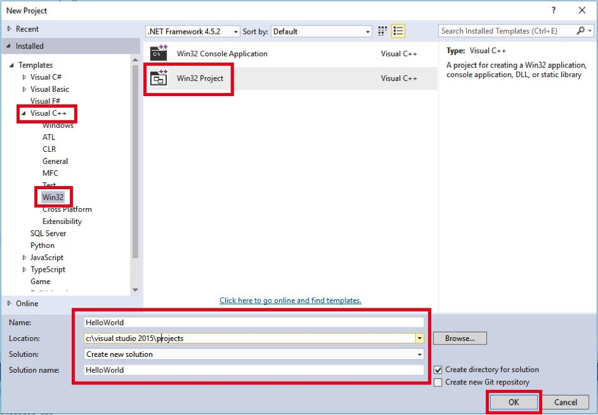
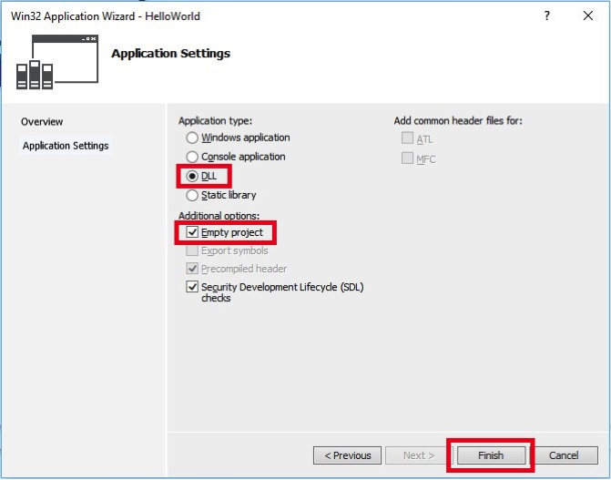
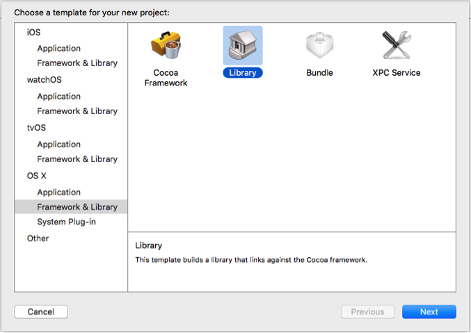
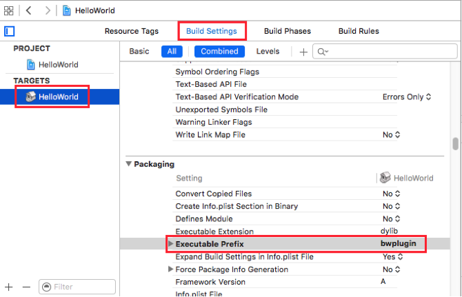

Writing a plugin in C++ is different for Windows and Mac OS. Follow the relevant instructions for your OS.

## Windows

### Prerequisite
* Windows 8 with SP1 or higher
* Visual Studio 13 or higher
* Visual C++ 11

### Creation process
1. Install VStitcher.
2. Open Visual Studio.
3. Go to File -> New -> Project.
4. In the New project wizard, choose Visual C++ -> Win32 -> Win32 Project.
Set your desired project name and location and click 'OK'.<br/>

5. On the Win32 Application Wizard, click 'Next'.
6. On the Application Settings page, select 'DLL' as the application type, and under Additional options check the 'Empty project' option. <br/>
Click 'Finish'. <br/>

7. This document is part of a plugin package that also contains Browzwear API header files and a library file (BwPluginApi.lib). Copy these files (while maintaining the folder structure) to your project directory.
8. Add the Browzwear API header files to your project via Project menu -> Add Existing Item... <br/>
Select all the Browzwear's API header files and click on 'Add'.
9. Add new source file and add the following code:
```cpp
// this will add all the relevant includes
// this will also link to the library file.
#include "BwPluginApi.h"

// implement initialization function
int BW_PLUGIN_EXPORT BwApiPluginInit()
{
  // return 1 for successful initialization
  return 1;
}
```
10. Create a file named plugin.json in the plugin folder. refer to "..\BWPlugin\schema\plugin_manifest.json" for more information.</br>
   
    Example of plugin.json file:
```json
{
  "identifier": {Your identifier},
  "name": {Your plugin name},
  "type": "cpp",
  "main": {Your dll path},
}
```
    Note:
    * 'type' should always be cpp if you are using c/c++ to create your plugin.
    * In the 'main' section you can omit the extension from the path and it will be resolved by Browzwear.

To use this plugin, you first need to update the project's settings.

### Project Settings
All the below settings must be changed on x64 platform configuration.
1. Go to Project menu -> [PROJECT_NAME] Properties…
2. Change the 'Output Directory' to:
```cpp
$(LOCALAPPDATA)\Browzwear\VStitcher\Plugins
```
4. In order to be able to debug the plugin, go to the Debugging section and change the command to:
```cpp
$(ProgramW6432)\Browzwear\VStitcher\{VSTICHER-VERSION}\VStitcher.exe
```

That's it, you just created your first plugin.

## Mac OS

### Prerequisite
* Mac OS 10.9 or higher
* Xcode 7.0 or higher
* Apple SDK Base: 10.9
* Apple OS X Deployment Target: 10.9

### Creation process
1. Install VStitcher.
2. Open Xcode.
3. Go to File -> New -> New Project.
4. In the New Project Assistant, choose OS X -> Framework & Library -> Library and click Next. <br/>

5. Set the project name, organization name and identifier, and under the Framework choose either ‘STL (C++ Library)’ or ‘None (Plain C/C++ Library)’. The type of the project must be ‘Dynamic’. Then click ‘Next’. <br/>

6. Set the project directory and click 'Create'.
7. This document is part of the plugin package that also contains Browzwear API header files. Copy these files (while maintaining the folder structure) to your project directory.
8. Add the Browzwear API header files to your project via File menu -> Add Files to 'PROJECT_NAME'...  
Select all the Browzwear's API header files and click on 'Add'.
9. In order to work with the Browzwear API you need to import the Browzwear API library (libBwPluginAPI.dylib) to this project.  
  * Open ‘Finder’ window.  
  * Go to ‘/Applications/Browzwear’.  
  * Right click on the VStitcher app file -> Show Package Contents.  
  * Go to Contents/MacOS.  
  * Drag the libBwPluginAPI.dylib file to your Xcode project.
  * Xcode will ask you to select the target to add this file to. Make sure that the right target is selected and that the ‘Copy items if needed’ is not selected.<br/>  
  
10. Create a file named plugin.json in the plugin folder. refer to "..\BWPlugin\schema\plugin_manifest.json" for more information.</br>
   Example of plugin.json file:
```json
{
  "identifier": {Your identifier},
  "name": {Your plugin name},
  "type": cpp,
  "main": {Your dylib path},
}
```
    Note:

      * 'type' should always be cpp if you using c/c++ to create your plugin.
      * In the 'main' section you can omit the extension from the path and it will be resolved by Browzwear.
<br/><br/>
To use this plugin, you first need to change the project's settings. 

### Project Settings
1. Go to the target settings and select your Plugin’s target -> Build Settings, look for the ‘Executable Prefix’ and change it from ‘lib’ to ‘bwplugin’. <br/>

2. VStitcher will load the plugins from ‘~/Library/Application Support/Browzwear/VStitcher/Plugins’ folder.
  * Go to the plugin’s target settings -> Build Settings, look for ‘Build Location’.
  * Set the ‘Pre-configuration Build Products Path’ setting to ~/Library/Application Support/Browzwear/VStitcher/Plugins.
3. Go to Product -> Scheme -> Edit Scheme, under ‘Executable’ change this to ‘Ask on Launch’ or to the VStitcher app.

That's it! You just created your first plugin.