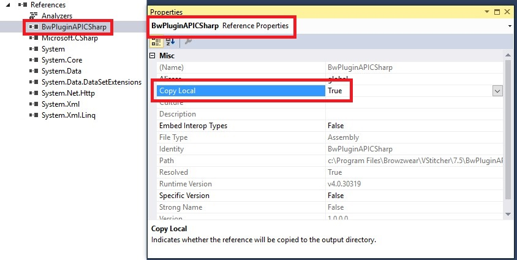

Browzwear supports writing a plugin in C#. Follow these steps to create a basic plugin:

## Create new project
1. Install VStitcher.
2. Open Visual Studio.
3. Go to File -> New -> Project.
4. In the New project wizard, choose Visual C# -> Class Library.
5. Set your desired project name and location and click 'OK'.
<br/><br/>

## Add Browzwear library to your project
1. Go to 'Project' menu -> 'Add Reference...'
2. Browse to '%PROGRAMFILES%\\Browzwear\\VStitcher\\{VSTITCHER-VERSION}'.
3. Select 'BwPluginAPICSharp.dll' file.
4. Click 'OK'.
5. Now that you have reference to 'BwPluginAPICSharp', right click on it and select 'Properties'.
6. Change the value of 'Copy Local' to False. <br/>

<br/><br/>

## Initialize plugin
Add the following code to an existing / new .cs file:
```csharp
using BwPluginApi;

//You must create the class under the global namespace
class BwApiPlugin
{
  // implement initialization function
  public static int Init(string args /*= Empty String!!! */)
  {
      // return 1 for successful initialization
      return 1; 
  }
}
```
<br/><br/>

## Create plugin.json file to your plugin
Create a file named plugin.json in the plugin folder. refer to "..\BWPlugin\schema\plugin_manifest.json" for more information.</br>
   Example of plugin.json file:
```json
{
  "identifier": {Your identifier},
  "name": {Your plugin name},
  "type": "c#",
  "main": {Your dll path},
}
```
  Note: 'type' should always be c# if you using c# to create your plugin. </li>

## Project settings
For the plugin to work you need to place it in the right folder. To change your project settings:
1. Go to your project Properties.
2. Under 'Build', change the 'Output path' to: **C:\\Users\\{USER}\\AppData\\Local\\Browzwear\\VStitcher\\Plugins**.
3. In order to be able to debug the plugin go to 'Debug' and do the flowing:
  * Set 'Start Action' to 'Start external program' and point to: </br>
**C:\\Program Files\\Browzwear\\VStitcher\\{VSTITCHER-VERSION}\\VStitcher.exe**
  * Make sure in 'Enable Debuggers' the checkbox "Enable native code debugging" is selected. <br/>

<br/><br/>

That's it! You just created your first plugin.