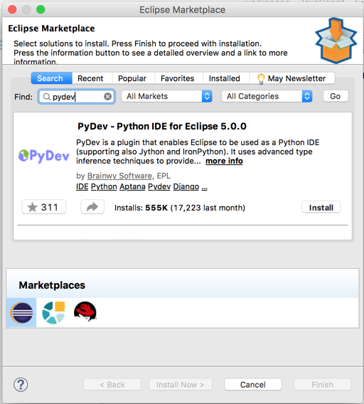
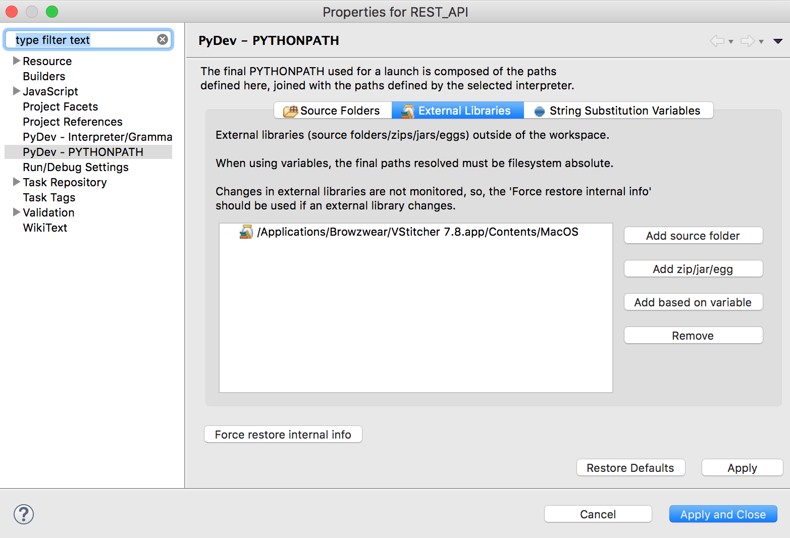

## Basic plugin
Browzwear supports writing a plugin in Python 3.6+. Follow these steps to create a basic plugin:

1. Install VStitcher.
2. Go to VStitcher's plugins folder: <br/>
```cpp
Windows:  %localappdata%\Browzwear\VStitcher\plugins
Mac:  ~/Library/Application Support/Browzwear/VStitcher/Plugins
``` 
   Note: If the Plugins folder doesn't exist, create it.
3. Create a new folder for your plugin.
4. Create another folder to contain the python plugin files - this will be the plugin package.
5. Create two new files within the plugin package folder: <br/>
```cpp
__init__.py
sample.py
```
5. Using your favorite Python editor, edit the files as follows: <br/>
```python
# __init__.py file

from sample import *
```

```python
# sample.py file

# import Browzwear API library
import BwApi

# implement initialization function
def BwApiPluginInit():
  # return 1 for successful initialization
  return 1
```
6. Create a file named plugin.json in the plugin folder. refer to "..\BWPlugin\schema\plugin_manifest.json" for more information.</br>
   Example of plugin.json file:
```json
{
  "identifier": {Your identifier},
  "name": {Your plugin name},
  "type": "python",
  "main": {Your plugin path},
}
```
  Note:'type' should always be python if you using python to create your plugin.

For this example, the file structure should look like this

```
SamplePlugin
│   plugin.json    
└───{Python package folder name}
    |   __init__.py
    |   sample.py
```

That's it! You just created your first plugin (which doesn't do anything yet). Go to 'API Usage' on the main page to extend your plugin.

## Setting up Eclipse for Python Development and Debugging

Get started with local development and debugging with Eclipse and the PyDev plugins. This configuration allows you to run your plugin in a debug mode and use Eclipse’s Debug perspective to set breakpoints and step through your code.

### Prerequisites
Install Python 3.6 if you do not already have it installed. </br>
Install Eclipse.

### Installing PyDev
After you install Eclipse, you should install the PyDev plugin that allows you to use Eclipse as a Python IDE.
1. In Eclipse, click **Help > Eclipse Marketplace.**
2. In the **Find** field, specify "PyDev".<br/>

3. Click **Install** and complete the installation wizard.
4. Restart Eclipse when prompted.

### Configuring your project
1. Create a new project: Click **File > New > Project.**
2. On the Select a wizard page, select **PyDev Project.**
3. On the PyDev Project page, name the project. Then, let Eclipse configure the default interpreter by clicking **Please configure an interpreter before proceeding.**<br/>
If Eclipse did not find a Python 3.6 interpreter, click the **Click here to configure an interpreter not listed** link to configure the interpreter.
4. click **Finish** to start with a blank project.

### Importing libraries for Eclipse to recognize

To have Eclipse recognize Browzwear Python library (BwApi):
1. Edit your Eclipse project’s properties: Right-click the project and select **Properties.**
2. Select **PyDev - PYTHONPATH** in the navigation pane of the dialog.
3. Select the **External Libraries** tab.
4. Click on **Add source folder** and browse to Browzwear's installation location.<br/>

5. Click **Apply and Close**

### Adding sample files to your plugin
1. Add a new file to your project and name it `plugin.json`.
2. Add the following content to your `plugin.json` file. (This is just an example and you must change this content for a real plugin.):

```json
{
  "identifier": "com.browzwear.sample",
  "name": "Sample plugin",
  "api_version": 2,
  "type": "python",
  "main": "src",
  "version": "1.0.1"
}
```
3. The actual plugin is a python package. As you can see in the example JSON, we tell Browzwear that the package name is `src`. (See `main` property.)
4. Create an `src` folder under your Project.
5. Within the `src` folder, add the following files:

```
src
|- __init__.py
|- sample.py
```

6. Update the `__init__.py` file with the following content:

```python
import * from sample
```
7. Update the `sample.py` file with the following content:

```python
# import Browzwear API library
import BwApi

# create a callback class for receiving menu action events
# this class inherits from BwApi.CallbackBase
# you can find out more information at the README.md file and on the BwPluginApi.h file
class CallbackSession(BwApi.CallbackBase):
  def Run(self: object, garment_id: str, callback_id: int, data_string: str):
    if callback_id == 1:
      BwApi.WndMessageBox('Hello World', BwApi.BW_API_MB_OK)

# initialize function that must be exported by the plugin
def BwApiPluginInit() -> int:
  # add menu item to the plugin menu
  BwApi.MenuFunctionAdd('Hello World', callbackMenu, 1)
  return 1

# create global instance for the menu callback class
callbackMenu = CallbackMenu()
```

### Debugging your plugin within Browzwear
1. Add VStitcher or Lotta as external tool in Eclipse: Click **Run > External Tools > External Tools Configurations..."**
2. Add new configuration: Click the **New** button
3. Under the **Name** write `Browzwear`
4. Under the **Location** field enter VStitcher / Lotta executable file
5. Click **Close**
6. Go back to your `sample.py` file and add the following code to the initialize function:

```python
import sys
sys.path.append(<path to pydevd/pysrc>)

def BwApiPluginInit() -> int:
  try:
    import pydevd

    # this line will cause the debugger to stop here and you will be able
    # to debug the plugin
    pydevd.settrace('localhost', port=5678)
  except:
    pass

  # add menu item to the plugin menu
  BwApi.MenuFunctionAdd('Hello World', callbackMenu, 1)
  return 1
```
7. Open the **Debug** perspective: Click **Window > Perspective > Open Perspective > Other ...**
8. Select the **Debug** perspective.
9. Set PyDev to listen to 5678 port: Click **Pydev > Start Debug Server**, you should see the following line on the console - `Debug Server at port: 5678`.
10. Launch VStitcher / Lotta from Eclipe using the configuration set at step #1:</br> Click **Run > External Tools > Browzwear**.
