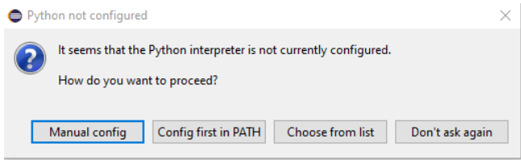
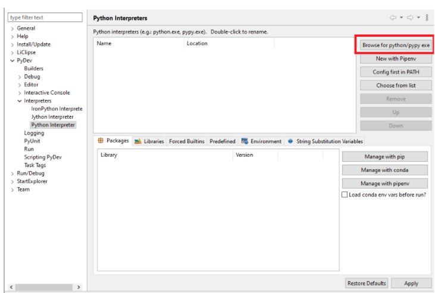
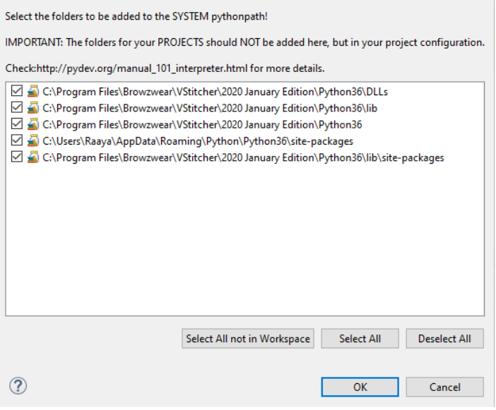
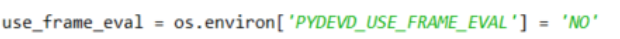
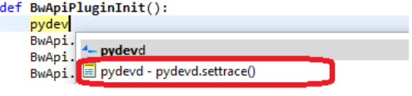
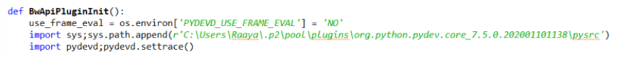
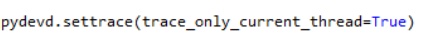
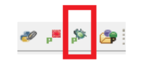

## Prerequisites
Install Python 3.7.8 if you do not already have it installed.  

## Basic plugin
You can build your first plugin with a few simple steps:
1. Download this boilerplate.
2. Update the plugin.json with your plugin's identifier and name
3. [Add the plugin](Development) to your app.

That's it! Now you'll see your plugin under the "Plugins" tab.  
Follow the "TODO" in "main.py" to configure your plugin

## Debug your plugin with Eclipse 
1. Install Eclipse.
2. Open your plugin project: File > Open Projects From File System and import your plugin.
3. Configure Python interpreter: 
    * Select manual config
      
    * Select **Browse for python/pypy exe** 
Go to your Browzwear folder and select Python folder.  For example :  %ProgramFiles%\Browzwear\VStitcher\{YOUR-VSTITCHER-VERSION}\Python

    * Select Ok
    
4. Add your plugin to VStitcher.
5. At the beginning of the init function (BwApiPluginInit):
    * Add the following line:
    
    * start writing pydev and choose the settrace() option as follow:
  
6. As a result the following lines will be added:

7. Add trace_only_current_thread=True as parameter to pydevd.settrace function:

8. Open the **Debug** perspective: **Click Window > Perspective > Open Perspective > Other ...**
9. Select the Debug perspective.
10. Start pyDev server using this button: 

