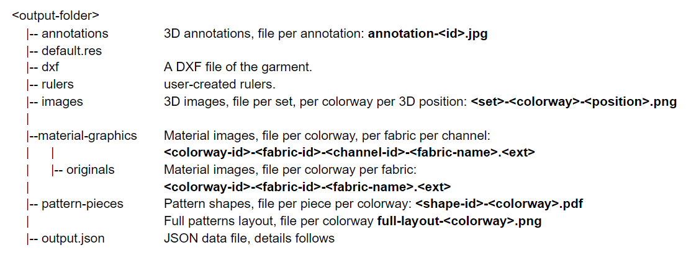

VStitcher's tech pack feature allows you to generate a technical package for production, including all specifications, materials, and patterns being used on the current 3D project. You can save standard tech pack settings for repeat use.

## Exporting the tech pack
The code snippet below shows how to export the tech pack for the current garment. <br/>
<!--DOCUSAURUS_CODE_TABS-->

<!--Python-->
```python
garmentId = BwApi.GarmentId()
# assuming that the presetName is an existing Tech pack preset
BwApi.GarmentTechpackExport(garmentId, presetName, outputFolder)
```
<!--C++-->
```cpp
BwApiString* garmentId;
BwApiGarmentId(garmentId);
// assuming that the presetName is an existing Tech pack preset
BwApiGarmentTechpackExport(garmentId, presetName, outputFolder)
```
<!--C#-->
```csharp
string garmentId;
BwApi.GarmentId(out garmentId);
// assuming that the presetName is an existing Tech pack preset
BwApi.GarmentTechpackExport(garmentId, presetName, outputFolder);
```
<!--END_DOCUSAURUS_CODE_TABS-->

<br/>

## Directory structure
VStitcher / Lotta Tech-Pack export produces a directory with image assets and an index JSON file with the exported data and references to the image assets.


