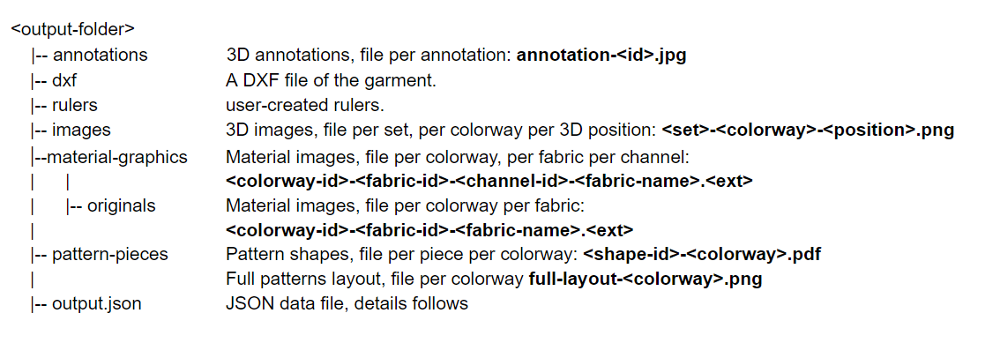

Tech pack is what you generate as a technical package for production, including all colorways images, BOM, artwork placement, etc being used on the garment. Use the Teck Pack API to export a tech pack using a preset.

For more information about the feature, please visit <a href="https://support.browzwear.com/VStitcher/Tech%20Packs/tech-packs-create.htm" target="_blank">here</a>.

To learn more about creating a tech pack preset, please visit <a href="https://support.browzwear.com/VStitcher/Tech%20Packs/tech-packs-save.htm" target="_blank">here</a>.

## Exporting the Tech Pack

### Code Snippet
The code snippet below shows how to export the tech pack for the current garment. <br/>
<!--DOCUSAURUS_CODE_TABS-->

<!--Python-->
```python
garmentId = BwApi.GarmentId()
# assuming that the presetName is an existing Tech pack preset
BwApi.GarmentTechpackExport(garmentId, presetName, outputFolder)
```
<!--C++-->
```cpp
BwApiString* garmentId;
BwApiGarmentId(garmentId);
// assuming that the presetName is an existing Tech pack preset
BwApiGarmentTechpackExport(garmentId, presetName, outputFolder)
```
<!--C#-->
```csharp
string garmentId;
BwApi.GarmentId(out garmentId);
// assuming that the presetName is an existing Tech pack preset
BwApi.GarmentTechpackExport(garmentId, presetName, outputFolder);
```
<!--END_DOCUSAURUS_CODE_TABS-->

<br/>

## Directory structure
VStitcher / Lotta Tech-Pack export produces a directory with image assets and an index JSON file with the exported data and references to the image assets.



## Techpack schema
You can find the schema for output.json <a href="https://gitlab.com/browzwear/share/open-platform/client-api/-/tree/master/BWPlugin/schema/api" target="_blank">here</a>

