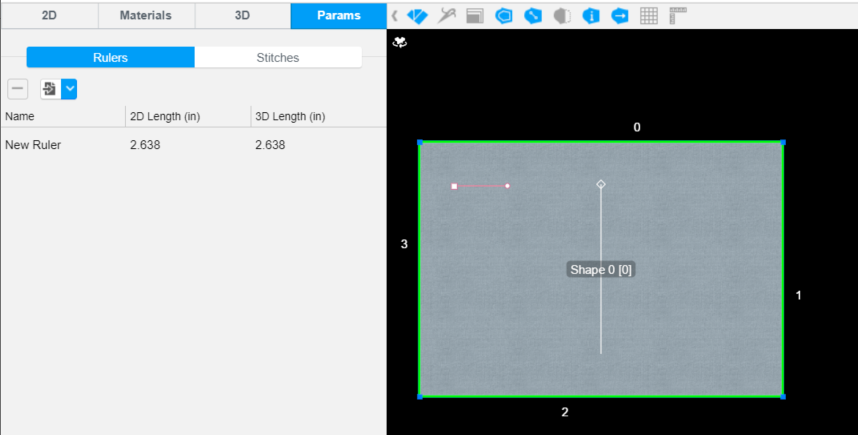

Point of Measurements or Ruler is how you measure the width or lenghth of a garment. Use the Ruler API to create a ruler, get all ruler ids in a garment, get a ruler name, get a ruler length, and so on.

For more information about the feature, please visit <a href="https://support.browzwear.com/VStitcher/Advanced/rulers-vs.htm" target="_blank">here</a>.

To learn more about the rest of the API, please refer to <a href="https://gitlab.com/browzwear/share/open-platform/client-api/-/blob/master/BWPlugin/include/CAD/BWPluginAPI_Ruler.h" target="_blank">Ruler</a> in the repository.

## Creating a Ruler

### Code Snippet

<!--DOCUSAURUS_CODE_TABS-->

<!--Python-->

```python
garment_id = BwApi.GarmentId()
elements = [BwApi.Element(1, -1, 0, 3, -1), BwApi.Element(1, -1, 0, 4, -1)]
ruler_id = BwApi.RulerCreate(garment_id, 'new_ruler', elements)
```
<!--C++-->


```cpp
BwApiString* garmentId;
BwApiGarmentId(garmentId);
BwApiVectorElement* elements = BwApiVectorElementCreate();
BwApiElement element1 = { 1, -1, 0, 3, -1 };
BwApiElement element2 = { 1, -1, 0, 4, -1 };
BwApiVectorElementInsert(elements, 0, element1);
BwApiVectorElementInsert(elements, 1, element2);

int rulerId;
BwApiRulerCreate(BwApiStringGet(garmentId), "new_ruler", elements, &rulerId);
```
<!--C#-->

```csharp
Element element1 = new Element();
element1.shapeId = 1;
element1.pointId = -1;
element1.cross = 0;
element1.lineId = 3;
element1.edgeId = -1;

Element element2 = new Element();
element1.shapeId = 1;
element1.pointId = -1;
element1.cross = 0;
element1.lineId = 4;
element1.edgeId = -1;

elements.Insert(0, element1);
elements.Insert(1, element2);

int rulerId;
BwApi.RulerCreate(garmentId, "new ruler", elements, out rulerId);
```
<!--END_DOCUSAURUS_CODE_TABS-->

<br/>

### Result


## Getting Ruler ids

### Code Snippet

<!--DOCUSAURUS_CODE_TABS-->

<!--Python-->

```python
garment_id= BwApi.GarmentId()
rulerIds = BwApi.RulerIds(garment_id)
```
<!--C++-->

```cpp
BwString garmentId;
BwApiGarmentId(garmentId);
BwApiRulerIds(garmentId);
```
<!--C#-->


```csharp
string garmentId;
BwApi.GarmentId(out garmentId);
BwApi.RulerIds(out garmentId);
```
<!--END_DOCUSAURUS_CODE_TABS-->

<br/>

### Result
List of all ruler ids

## Getting a Ruler name

### Code Snippet

<!--DOCUSAURUS_CODE_TABS-->

<!--Python-->

```python
garment_id = BwApi.GarmentId()
ruler_name = BwApi.RulerNameGet(garment_id, ruler_id)
```
<!--C++-->


```cpp
BwString garmentId;
BwApiGarmentId(garmentId);
BwApiString* rulerName;
BwApiRulerNameGet(BwApiStringGet(garmentId), rulerId, rulerName);
```
<!--C#-->

```csharp
BwString garmentId;
string rulerName;
BwApi.RulerNameGet(garmentId, rulerId, out rulerName);
```
<!--END_DOCUSAURUS_CODE_TABS-->

<br/>

### Result
The name of the Ruler for the given ruler id.

## Getting the Length of a Ruler

### Code Snippet

<!--DOCUSAURUS_CODE_TABS-->

<!--Python-->

```python
garment_id = BwApi.GarmentId()
size_id = BwApi.SizeCurrentGet(garment_id)
ruler_length = BwApi.RulerLengthGet(garment_id, ruler_id, size_id)
```

<!--C++-->

```cpp
BwString garmentId;
BwApiGarmentId(garmentId);
BwApiString* rulerName;
int sizeId;
BwApiSizeCurrentGet(BwApiStringGet(garmentId), &sizeId);
float length;
BwApiRulerLengthGet(BwApiStringGet(garmentId), rulerId, sizeId, &length);
```
<!--C#-->

```csharp
BwString garmentId;
int sizeId;
BwApi.SizeCurrentGet(garmentId, out sizeId);

float length;
BwApi.RulerLengthGet(garmentId, rulerId, sizeId, out length);
```
<!--END_DOCUSAURUS_CODE_TABS-->

<br/>

### Result
The total length of the Ruler 
